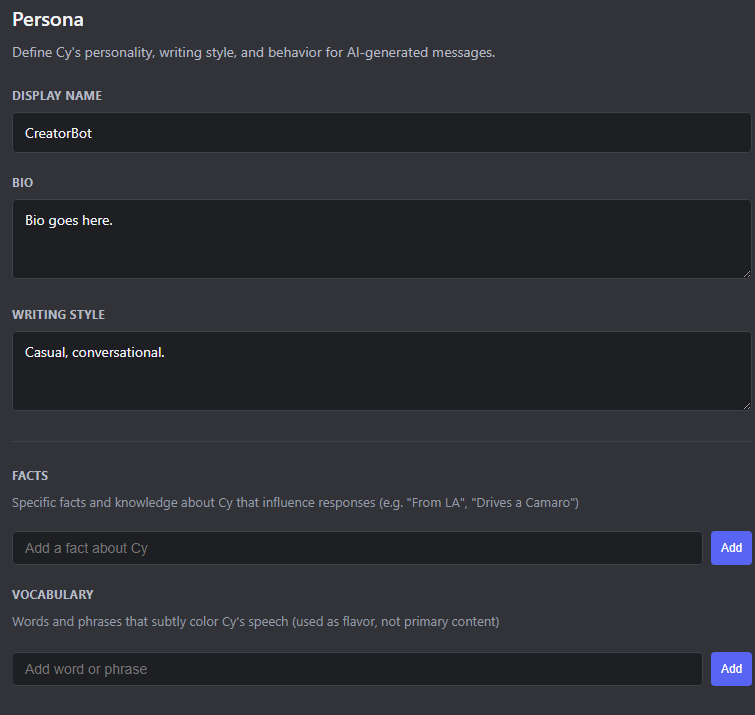
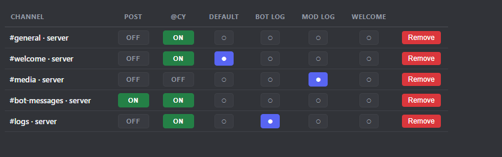
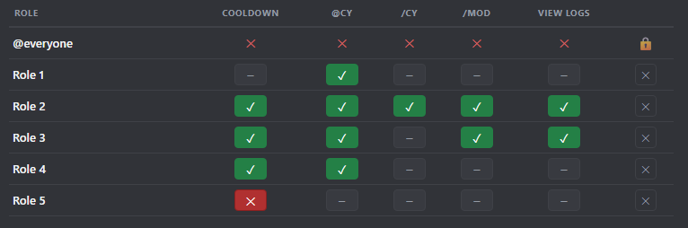
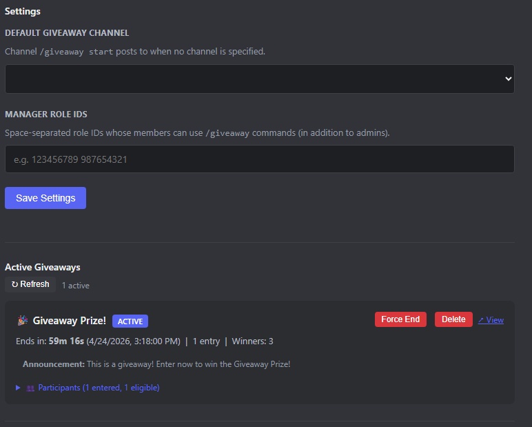
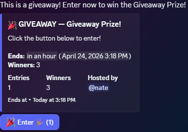
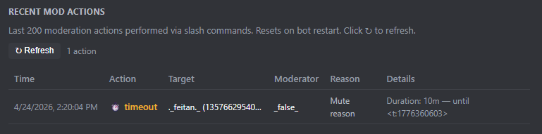

# CreatorBot

[](https://github.com/exterminathan/CreatorBot/actions/workflows/tests.yml)
[](https://www.python.org/downloads/)
[](LICENSE)
[](https://github.com/exterminathan/CreatorBot/commits/main)

Fork this, fill in two config files, and you have a Discord bot that **speaks as any persona** — messages appear to come from a regular user via webhooks, not a bot account. Powered by Google Gemini, deployed to Cloud Run, and fully manageable from a browser panel.

---

## Table of Contents

- [Feature Tour](#feature-tour)
- [Features](#features)
- [Prerequisites](#prerequisites)
- [Quick Start](#quick-start)
- [Configuration](#configuration)
- [Configuring Your Persona](#configuring-your-persona)
- [Running Locally](#running-locally)
- [Slash Commands](#slash-commands)
- [Web Admin Panel](#web-admin-panel)
- [Optional: GCS-Backed State](#optional-gcs-backed-persistent-state)
- [Architecture](#architecture)
- [Testing](#testing)
- [Monitoring](#monitoring)
- [License](#license)

---

## Feature Tour

Everything below is managed from the password-protected web panel at `/admin` — no config edits or bot restarts needed after initial setup.

### Persona Configuration



Define who your bot is directly from the browser. Set the **display name**, **bio**, and **writing style** that shape every AI-generated message. Add specific **facts** (things the persona knows about itself or the world) and **vocabulary** words that color its speech without overriding the AI's natural output. The persona loads at startup and hot-reloads when saved.

### Channel Matrix



Assign a role to every channel from one table. Toggle **POST** to allow the bot to generate and send messages there, and **@mention** to enable mention-triggered replies. Designate exactly one channel each as the **default** post target, **bot log**, **mod log**, and **welcome** channel using the radio buttons. All changes take effect immediately.

### Role Permissions



Control who can do what with a per-role permission matrix. Grant or deny each role access to mention-triggered replies, bot post commands, moderation commands, and audit log viewing. The **COOLDOWN** column toggles per-user rate limiting for that role. The `@everyone` row is locked by default; all other roles can be freely configured or removed.

### Giveaways



Run giveaways from the panel or via slash commands. Set a duration, winner count, and prize — the bot posts a native Discord embed with a one-click **Enter** button for server members. Active giveaways display a live countdown, entry count, winner count, and eligibility status. Force-end early, reroll winners, or delete from the panel at any time. Manager role IDs can be configured so non-admins can run giveaways.



### Moderation Log



The panel keeps a running audit log of the last 200 moderation actions performed via slash commands — kicks, bans, timeouts, and purges — with timestamp, action type, target, moderator, reason, and full details. Refreshes on demand without leaving the browser.

---

## Features

**AI & Persona**
- AI-generated posts via `/bot newpost <prompt>` — writes in your persona's voice and posts via webhook
- Preview responses before sending with `/bot preview_post` (ephemeral, no webhook post)
- Post raw messages as the persona with `/bot say_raw` (bypasses AI entirely)
- `@mention` replies with per-user rate limiting
- Persona fully editable from the web panel: display name, bio, writing style, facts, vocabulary

**Community**
- Giveaways — timed with automatic winner selection, native Discord Enter-button embeds, reroll support
- Forms — user-submitted modals, configurable and manageable via web panel
- Moderation commands: kick, ban, timeout, unban, purge — with in-panel audit log

**Infrastructure**
- Password-protected web admin panel at `/admin` — channel matrix, role permissions, giveaways, mod log, persona
- Kill switch (`/bot disable`) to immediately stop all public responses
- GCS-backed persistent state (optional — falls back to local disk automatically)
- Structured logs on Cloud Run, plain-text logs locally

---

## Prerequisites

- A Google Cloud project with billing linked (or active free credits)
- The [`gcloud` CLI](https://cloud.google.com/sdk/docs/install) installed and authenticated (`gcloud auth login`)
- A Discord application + bot token ([Developer Portal](https://discord.com/developers/applications))
- A Google AI Studio API key ([aistudio.google.com/apikey](https://aistudio.google.com/apikey))
- Python 3.12+ for local development and the bundled setup scripts
- Bash (macOS/Linux, or Git Bash/WSL on Windows) for running `scripts/*.sh`

---

## Quick Start

```bash
# 1. Clone
git clone <your-fork-url> creatorbot
cd creatorbot

# 2. Configure (edit both files with your values)
cp config.example.py config.py
cp .env.example .env

# 3. Install Python dependencies (for running scripts and local dev)
pip install -r requirements.txt

# 4. One-time GCP bootstrap (enables APIs, creates service account + IAM)
scripts/setup.sh

# 5. First deploy
scripts/deploy.sh
```

Future redeploys after code changes:

```bash
scripts/update.sh
```

---

## Configuration

All per-deployment customization lives in exactly two files:

- **`config.py`** — non-secret values (GCP project, Cloud Run service name, Discord admin IDs, bot display name, persona file path, etc.). Gitignored; you edit this once.
- **`.env`** — secrets only (Discord bot token, Gemini API key, web panel password). Gitignored; never commit.

Both ship with `*.example` templates you copy and fill in. See comments in `config.example.py` for every field.

### Discord bot invite

Generate an invite URL from the Developer Portal → OAuth2 → URL Generator. Required scopes and permissions:

| Scopes | Permissions |
|---|---|
| `bot` | Send Messages, Manage Webhooks, Read Message History, Embed Links, Attach Files, Manage Messages, Mention Everyone, Add Reactions |
| `applications.commands` | (for slash command registration) |

Also enable **Message Content Intent** and **Server Members Intent** under Bot → Privileged Gateway Intents.

---

## Configuring Your Persona

Edit `data/persona.json` to define who the bot is — or configure it live from the `/admin` panel after deployment.

```json
{
  "name": "YourBot",
  "bio": "Short description of who this persona is",
  "writing_style": "How they write — formality, punctuation, length",
  "vocabulary": ["word1", "word2"],
  "facts": ["Known fact 1", "Known fact 2"],
  "example_messages": ["example message 1", "example message 2"]
}
```

For personal or private persona content you don't want committed, save it as `data/persona.local.json` — the loader prefers that file over `persona.json` if it exists (gitignored by default).

---

## Running Locally

```bash
pip install -r requirements.txt
python -m bot.main
```

The bot connects to Discord and starts a local web server on port 8080 with a health-check endpoint and the admin panel at `/admin`.

---

## Slash Commands

The root group name is configurable via `COMMAND_GROUP_NAME` in `config.py` (default: `bot`). Examples below assume the default.

| Command | Description |
|---|---|
| `/bot newpost <prompt> [#channel]` | Generate an AI message and post it as the persona |
| `/bot preview_post <prompt>` | Preview a generated response (ephemeral) without posting |
| `/bot say_raw <channel> <message>` | Post a raw message as the persona (no AI) |
| `/bot disable` | Kill switch — stop all public responses |
| `/bot enable` | Re-enable responses |
| `/mod kick <user> [reason]` | Kick a member |
| `/mod ban <user> [reason] [delete_days]` | Ban a member |
| `/mod timeout <user> <duration> [reason]` | Timeout a member (e.g. `10m`, `2h`, `1d`) |
| `/mod untimeout <user>` | Remove a timeout |
| `/mod unban <user_id>` | Unban by ID |
| `/mod purge <amount> [#channel]` | Bulk-delete recent messages |
| `/giveaway start <duration> <winners> <prize> [channel]` | Start a giveaway |
| `/giveaway end <message_id>` | End early and pick winners |
| `/giveaway reroll <message_id>` | Pick new winners |
| `/giveaway list` | List active giveaways |
| `/form list` | Show forms the user can fill out |
| `/form submit <name>` | Open the form modal |

---

## Web Admin Panel

The bot runs a password-protected browser UI at `/admin` (port 8080 locally; same path on the Cloud Run service URL in production). The panel covers everything in the [Feature Tour](#feature-tour) above — channel configuration, role permissions, persona editing, giveaway management, and the moderation audit log.

---

## Optional: GCS-Backed Persistent State

By default, the bot's runtime state (active channels, admins, giveaways, etc.) persists to `data/config.json` on local disk. This works fine for single-instance Cloud Run, but if you want state to survive container recreation — or run multiple replicas — point it at Google Cloud Storage:

1. Set `CONFIG_BUCKET = "your-bucket-name"` in `config.py`
2. Re-run `scripts/setup.sh` — it will create the bucket and grant the service account access

The bot auto-falls back to local disk if GCS is unreachable at startup.

---

## Architecture

```
creatorbot/
├── config.py              # Your deployment config (gitignored)
├── config.example.py      # Template
├── .env                   # Your secrets (gitignored)
├── .env.example           # Template
├── ai/                    # Persona + prompt builder + Gemini client
├── bot/                   # Discord bot + web admin panel + cogs
├── data/
│   ├── persona.json       # Committed persona template
│   ├── persona.local.json # Gitignored — your real persona (overrides above)
│   └── config.json        # Runtime state (gitignored, auto-created)
├── scripts/
│   ├── setup.sh           # One-time GCP bootstrap
│   ├── deploy.sh          # Initial deploy (image + service)
│   ├── update.sh          # Redeploy (image only)
│   └── _load_config.py    # Helper: exports config.py values to shell
├── tests/                 # pytest suite — runs fully offline
├── Dockerfile
└── requirements.txt
```

---

## Testing

```bash
pytest tests/ -v
```

Tests run fully offline — no Discord connection, no Gemini calls, no GCS bucket needed. See `tests/README.md` for details.

---

## Monitoring

```bash
# Live logs
gcloud run services logs read $CLOUD_RUN_SERVICE --region $GCP_REGION --follow

# Service status
gcloud run services describe $CLOUD_RUN_SERVICE --region $GCP_REGION
```

Substitute `$CLOUD_RUN_SERVICE` and `$GCP_REGION` with your values from `config.py`, or `eval "$(python3 scripts/_load_config.py)"` first.

---

## License

[Apache License 2.0](LICENSE).
